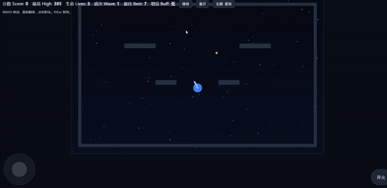

## 坦克大战 · Tank Battle (Web)

一个基于 HTML5 Canvas 的轻量坦克射击游戏，支持键鼠与移动端触控，包含敌人种类、道具、主题切换、粒子特效与本地排行榜。

### 演示 GIF



### 玩法
- 控制坦克移动射击，击毁来袭敌人。
- 敌人按波次生成，难度逐步提升。
- 波次间可能生成道具：拾取可治疗或提升射速（限时）。
- 生命归零后游戏结束，自动记录最高分与最佳波次。

### 操作
- 键盘：W/A/S/D 或 方向键 移动；P/Esc 暂停。
- 鼠标：指向瞄准，左键射击。
- 触控：左下虚拟摇杆移动，右下按钮射击。

### 当前特性
- 主题：草原 / 星际，一键切换。
- 敌人：侦察（快/脆）、重装（慢/高血）、狙击（中速/远射）。
- 道具：治疗（+1 生命）、急射（短时降低射击冷却）。
- 画面与音效：网格/星空背景、墙体障碍、爆炸粒子、基础 WebAudio 音效。
- 排行：本地 `localStorage` 保存最高分与最佳波次。

### 运行
- 直接打开根目录 `index.html` 即可游玩；或部署到 GitHub Pages/Netlify/Vercel。

### 目录结构
```
├─ index.html
├─ styles.css
├─ assets/
│  └─ tank-battle.gif
└─ src/
   └─ game.js
```

### 许可证
MIT License
